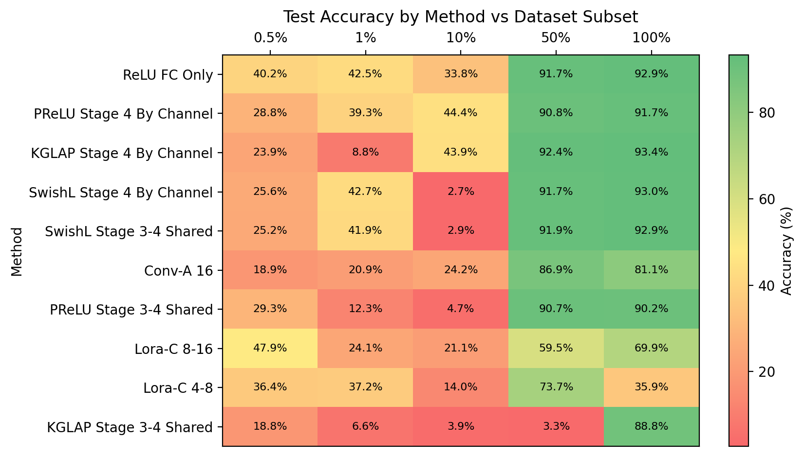
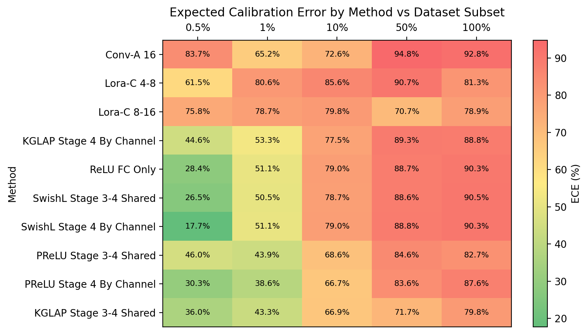
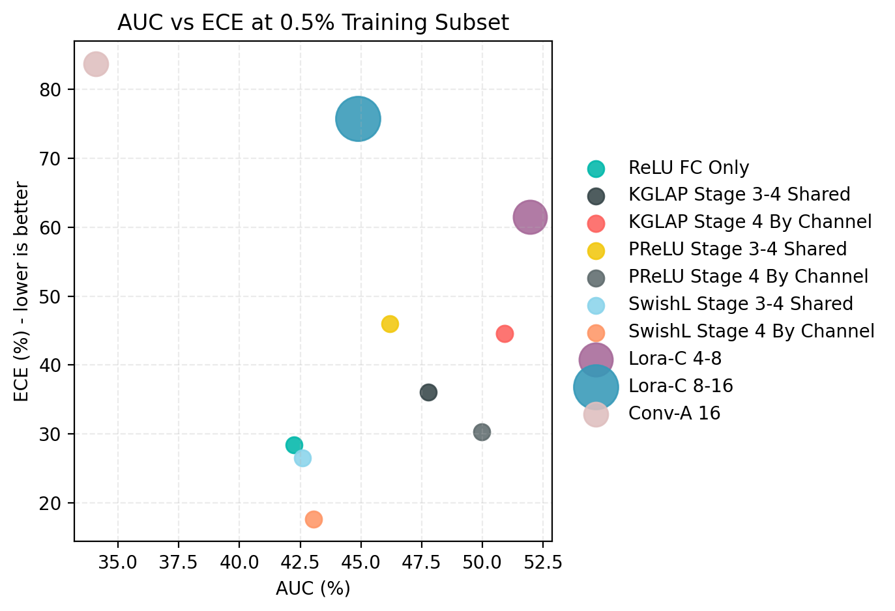
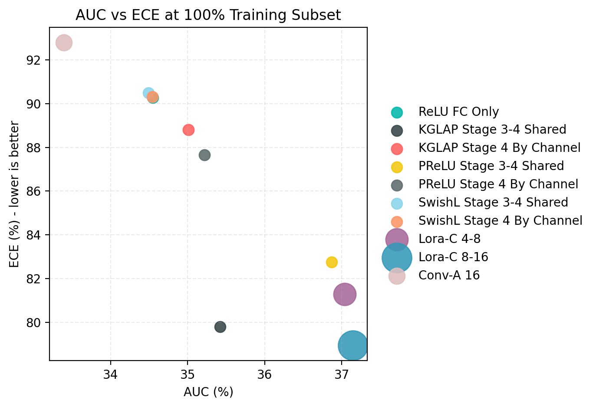
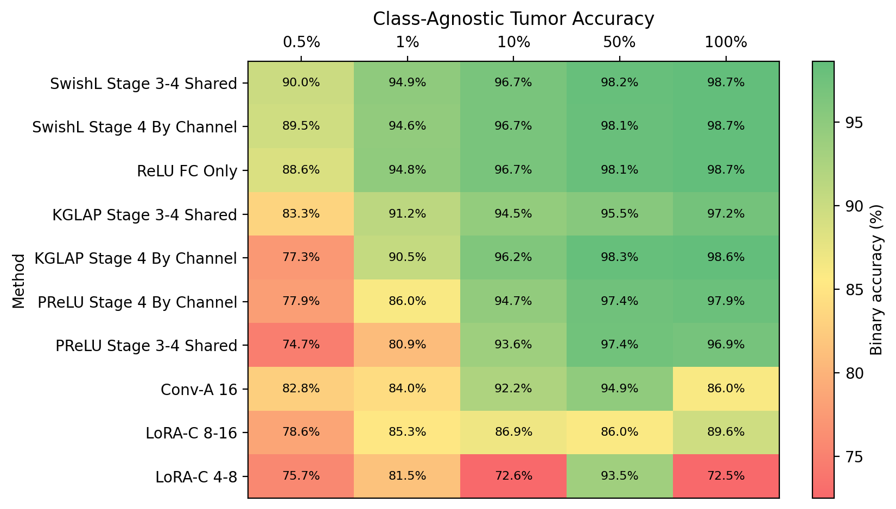

# CalibraCT

Calibration-focused transfer learning for pretrained CNNs using learnable activation functions.

CalibraCT is the code artifact for my research internship paper, [*Investigating low-resource adaptation of pre-trained CNNs to new domains through non-linearity calibration*](docs/report.pdf). The project studies whether a frozen ImageNet-pretrained ResNet-50 can be adapted to a low-resource medical imaging task by tuning only a tiny set of nonlinear activation parameters plus the classifier head.

The main result is nuanced: learnable activations do not consistently beat a linear-head baseline on raw accuracy, but they provide a strong calibration and parameter-efficiency tradeoff. In low-data regimes, channel-wise PReLU and KGLAP sit on the AUC/ECE Pareto frontier while training less than 0.06% of the model parameters.

## Technical Idea

The benchmark starts from a ResNet-50 v1.5 backbone with ImageNet weights. Most pretrained weights are frozen, the classification head is replaced for the four-class brain tumor task, and selected ReLU sites in the later residual stages are replaced with trainable activations.

Implemented activation-tuning variants:

| Method | Adapted component | Trainable footprint |
| --- | --- | --- |
| ReLU FC Only | classifier head only | 8,196 params |
| PReLU | learned negative slope | <0.05% of ResNet-50 |
| SwishLearn | learned Swish beta | <0.05% of ResNet-50 |
| KGLAP | learned spatial/nonlinear response inspired by Klein-Gordon dynamics | <0.06% of ResNet-50 |
| Conv-Adapter | residual convolutional adapters | ~0.73% of ResNet-50 |
| LoRA-C | low-rank convolution updates | ~1.9-3.6% of ResNet-50 |

KGLAP is implemented as:

```text
f(y) = y + alpha * Laplacian(y) + beta * y + gamma * y^k
```

where `alpha`, `beta`, and `gamma` are learned and the Laplacian is applied channel-wise with a fixed 3x3 kernel.

## Results

The curated metrics used for these plots live in [results/final_metrics.csv](results/final_metrics.csv). The figures can be regenerated with `python scripts/make_figures.py --metrics results/final_metrics.csv`.











## Repository Layout

```text
src/calibract/
  models/      ResNet-50, learnable activations, Conv-Adapter, LoRA-C
  data/        Kaggle Brain MRI, ISIC, and PathMNIST loaders
  training/    training loops, experiment dispatch, activation-map utilities
  experiment_logging.py
configs/       reproducible experiment grid
scripts/       benchmark and figure-generation entrypoints
results/       curated final metrics used in the paper figures
docs/          report PDF, generated README assets, reproducibility notes
tests/         smoke and unit tests
```

## Setup

Use Python 3.10+ and install the package in editable mode:

```bash
python -m venv .venv
source .venv/bin/activate  # Windows: .venv\Scripts\activate
pip install -e ".[dev]"
```

For a simpler non-editable dependency install:

```bash
pip install -r requirements.txt
```

## Data And Weights

The repository intentionally does not track datasets, checkpoints, raw Excel logs, containers, or pretrained `.pth` files.

Download the Kaggle Brain Tumor MRI dataset from [Kaggle](https://www.kaggle.com/datasets/masoudnickparvar/brain-tumor-mri-dataset), then point CalibraCT to the extracted ImageFolder-style directory:

```bash
set CALIBRACT_DATA_DIR=C:\path\to\Kaggle Brain MRI
```

On macOS/Linux:

```bash
export CALIBRACT_DATA_DIR=/path/to/Kaggle\ Brain\ MRI
```

By default, pretrained ResNet-50 weights are downloaded through PyTorch. For offline/HPC runs, place `resnet50-11ad3fa6.pth` in a local directory and set:

```bash
set CALIBRACT_PRETRAINED_DIR=C:\path\to\pretrained_model
```

## Running Experiments

Print the full experiment grid without training:

```bash
python scripts/run_benchmark.py --config configs/kaggle_brain_mri.yaml --print-configs-only
```

Run the full benchmark:

```bash
python scripts/run_benchmark.py --config configs/kaggle_brain_mri.yaml
```

Useful environment variables:

| Variable | Purpose |
| --- | --- |
| `CALIBRACT_DATA_DIR` | Dataset root override |
| `CALIBRACT_OUTPUT_DIR` | Logs and checkpoints output directory |
| `CALIBRACT_PRETRAINED_DIR` | Optional local pretrained weight directory |

## Verification

Run the lightweight test suite:

```bash
python -m unittest discover -s tests
```

The tests instantiate the core model modes, validate activation-map placement, check ECE behavior, and exercise the Kaggle-style ImageFolder loader on a tiny synthetic dataset.

## Notes

The original research work was run on Digital Research Alliance of Canada / Compute Canada GPU infrastructure with Apptainer. See [docs/reproducibility.md](docs/reproducibility.md) for HPC notes and artifact policy.
